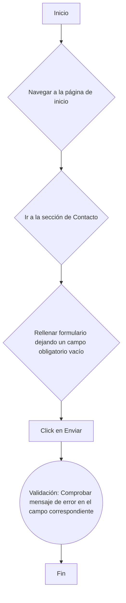

# Desarrollo de Suite de Pruebas Automatizadas - FacePhi

Este repositorio contiene la solución a la **Parte 2: Desarrollo de la Suite de Pruebas Automatizadas** de la prueba técnica para el puesto de QA Senior en FacePhi.

## 🎯 Sitio Bajo Pruebas

La suite de pruebas se ejecuta sobre el sitio web de **FacePhi**, específicamente en la página de contacto.

## ✨ Tecnologías Utilizadas

La suite está construida sobre un stack de JavaScript moderno, utilizando las siguientes herramientas:

-   **Node.js:** Entorno de ejecución para JavaScript.
-   **Selenium WebDriver:** Para la automatización y control del navegador.
-   **Jest:** Framework y ejecutor de pruebas.
-   **Jest-Cucumber:** Adaptador para escribir y ejecutar pruebas en formato BDD con Gherkin (`.feature`).
-   **Chromedriver:** Para controlar el navegador Google Chrome en las ejecuciones locales.

## 🚀 Cómo Empezar y Ejecutar Pruebas

### 1. Prerrequisitos

-   **Node.js** (versión 18 o superior).
-   **NPM** (generalmente se instala con Node.js).

### 2. Instalación

1.  Clona el repositorio en tu máquina local.
    ```bash
    git clone https://github.com/FcoPG/prueba_tecnica_facephi.git
    ```
2.  Navega hasta el directorio `parte2`. **IMPORTANTE:** Las ejecuciones deben realizarse desde dentro de este directorio.
3.  Instala las dependencias del proyecto:
    ```bash
    npm install
    ```

### 3. Ejecución de las Pruebas

-   **Para ejecutar todas las pruebas:**
    ```bash
    npm test
    ```
-   **Para ejecutar solo las pruebas de la feature de contacto:**
    ```bash
    npm test -- contacto
    ```
Las pruebas se ejecutan en un navegador **Chrome local** con interfaz gráfica por defecto.

## 📂 Arquitectura y Diseño

La suite sigue el patrón de diseño **Page Object Model (POM)** para separar la lógica de la interfaz de usuario de los casos de prueba, facilitando el mantenimiento.

### Estructura del Proyecto
```
/parte2
├── fixtures/
│   ├── contactoData.json         # Datos de prueba válidos.
│   └── contactoDataError.json    # Datos de prueba para escenarios de error.
├── src/
│   ├──config/
│   │   └── env.js                # Configuración de entorno (BASE_URL, timeouts, browser)
│   ├── pages/
│   │   ├── BasePage.js           # Clase base para todos los Page Objects.
│   │   ├── ContactPage.js        # Page Object para la página de contacto.
│   │   └── HomePage.js           # Page Object para la página de inicio.
│   └── support/
│       └── driverFactory.js      # Fábrica para crear y configurar el driver de Selenium.
├── tests/
│   ├── features/
│   │   └── contacto.feature      # Escenarios de prueba en Gherkin.
│   └── step_definitions/
│       └── contacto.steps.js     # Implementación de los pasos Gherkin.
├── jest.config.cjs               # Configuración de Jest.
├── package.json                  # Dependencias y scripts del proyecto.
└── README.md                     # Este archivo.
```

### Diseño con Page Object Model (POM)

-   **BasePage.js:** Contiene métodos reutilizables por todas las páginas (ej. esperas, clics).
-   **HomePage.js:**
    -   Navegar a la web de FacePhi.
    -   Gestionar banner de cookies.
    -   Acceder a la sección "Contacta".
-   **ContactPage.js:**
    -   Rellenar formulario usando datos desde archivos JSON.
    -   Seleccionar opciones de listas desplegables.
    -   Interactuar con campos y enviar el formulario.
    -   Validar mensajes de confirmación (éxito) y de error (negativo).

### Fixtures Utilizados

-   **contactoData.json:** Contiene un set de datos válidos para completar el formulario.
-   **contactoDataError.json:** Simula un usuario que deja un campo obligatorio (Empresa) vacío para probar la validación de errores.


## 📝 Resumen de Pruebas

### ¿Qué se ha probado?

La suite actual valida la funcionalidad clave del **formulario de contacto**, cubriendo los siguientes escenarios de `contacto.feature`:

1.  **Envío Exitoso:**
    -   **Flujo:** Navegar a "Contacto", rellenar el formulario con datos de `contactoData.json`, enviarlo y comprobar el mensaje de confirmación.
2.  **Validación de Campos Obligatorios:**
    -   **Flujo:** Navegar a "Contacto", rellenar el formulario usando `contactoDataError.json` (dejando un campo obligatorio vacío), enviarlo y validar que se muestra el mensaje de error esperado.


### Diagramas de Flujo de Pruebas

#### Diagrama 1: Flujo de Envío Exitoso 
```mermaid
flowchart TD
    A[Inicio] --> B{Navegar a la página de inicio};
    B --> C{Ir a la sección de Contacto};
    C --> D{Rellenar formulario con datos válidos}(Validación: Verificar que la URL es la correcta),(Validación: Verificar que el título de la página es el esperado), ;
    D --> E[Click en Enviar];
    E --> F((Validación: Comprobar mensaje de confirmación));
    F --> G[Fin];
```

#### Diagrama 2: Flujo de Validación de Campos Obligatorios



### Limitaciones y Mejoras Propuestas

- **Aumentar la Cobertura Funcional del Formulario**  
  Incluir validaciones adicionales como formato de email, longitud mínima de los campos y obligatoriedad del checkbox de consentimiento.

- **Validación Integral del Comportamiento del Formulario**  
  Probar estados condicionados (por ejemplo, campos que aparecen según la industria seleccionada) y comportamiento ante inputs no válidos o alterados.

- **Ejecutar Cross-Browser y Cross-Platform**  
  Añadir compatibilidad con Firefox, Safari y dispositivos móviles utilizando Selenium Grid, BrowserStack o SauceLabs.

- **Integrar Reportes de Pruebas Profesionales**  
  Implementar Allure Reports o HTML Reporters para obtener trazabilidad completa, historial y métricas visuales.

- **Reducir Flakiness y Mejorar Estabilidad**  
  Incorporar mecanismos de reintentos, mejor manejo de waits explícitos y detección inteligente de elementos dinámicos.

- **Automatizar el Pipeline de Pruebas**  
  Añadir CI/CD con GitHub Actions o GitLab CI para ejecutar las pruebas automáticamente en cada commit o pull request.

